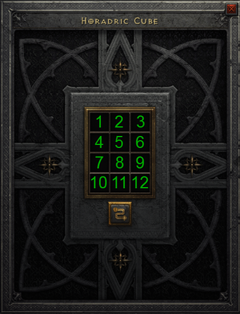

# 魔兽世界版的赫拉迪克方块 / Horadric-Cube-for-World-of-Warcraft
基于《暗黑破坏神2》的赫拉迪克方块功能制作的基于Eluna的魔兽世界功能扩展 / Horadric Cube for World of Warcraft  

### 视频演示 / Video Demo

https://github.com/user-attachments/assets/5fb3af7b-ffef-46ea-96ec-27120b11cae1

### 中文  
本项目是基于《暗黑破坏神2》的赫拉迪克方块功能制作的基于Eluna的魔兽世界功能扩展。可以在游戏中实现以下功能：  
- 物品合成  
- 物品转换  
- 传送  
- 开启隐藏的传送门

本项目对所使用音频与图像不享有版权

#### 要求:
需要服务端支持 Eluna 功能

#### 界面以及使用说明

1-9 号槽位用于放入物品 通过拖拽将背包内的物品放入到方块中 1-9号槽位中的任意位置

10-12 号槽位用于输出产物 存放在这里的物品不会因角色离线而消失,这些数据保存在服务端内,当使用者再次打开界面将会显示,如果服务端重新启动或者重新加载Eluna那么这些数据将丢失

### English  
This project is a World of Warcraft functionality extension based on Eluna, inspired by the Horadric Cube from Diablo II. It allows the following features in the game  
- Item crafting  
- Item transmutation  
- Teleportation  
- Opening hidden portals 

The audio and images used in this project are not copyrighted

#### Requirements:
Requires the server to support Eluna functionality.

#### Interface and Usage Instructions

Slots 1-9 are used for placing items. You can drag items from your inventory into any of the slots (1-9) of the cube. 

Slots 10-12 are used for the output products. Items placed here will not disappear when the character logs out, as these data are stored on the server. When the user reopens the interface, the items will reappear. However, if the server is restarted or Eluna is reloaded, these data will be lost.  

## 名称 / Name
Horadric Cube for World of Warcraft

## 作者 / Author
TITIaio

## 存储库 / Repository
[GitHub Repository](https://github.com/TITIaio/Horadric-Cube-for-World-of-Warcraft)

## 下载 / Download
[Download Source Code as .zip](https://github.com/TITIaio/Horadric-Cube-for-World-of-Warcraft/archive/refs/heads/main.zip)

## License
[GNU General Public License v3.0 (GPL-3.0)](https://opensource.org/licenses/GPL-3.0)
